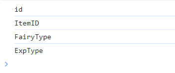

<div fontsize align="center">

<a href="https://github.com/alicestoneprod/dnt-readerjs"><h1>dnt-readerjs</h1></a>
<p><strong>dnt-readerjs</strong> is a simple way to extract data from Dragon Nest Table (DNT) files<p>
</div>

## Content

1. [Install](#install)
2. [Introduction](#introduction)
3. [Contributing](#contributing)

<h2 align="center" id="install">💻 Install</h2>

Install with npm:

```bash
npm install --save-dev dnt-readerjs
```

Install with yarn:

```bash
yarn add dnt-readerjs --dev
```

<h2 align="center" id="introduction">📚 Introduction</h2>

Install with npm:

```js
import extractData from "dnt-readerjs"

// You should read file as ArrayBuffer to use this function before
// Please, provide the correct extention (.dnt) of file before using data extract function

// Example: fairytypetable.dnt
const result = extractData(fileArrayBuffer, "fairytypetable.dnt")
const { data, columnNames, columnTypes, columnIndexes, numRows, numColumns } = result

// Now you can use all data how you want
columnNames.forEach((column) => console.log(column))
```

<div align=center>Output:</br>
</div>
<hr>

<div align=center id="contributing"><h1>🤝 Contributing</h1></br>
<p>If you wish you can become a contributor to `dnt-readerjs` and help improve the library or make its documentation more comprehensive.</p>
</div>
<hr>
<div align=center><h4>❤️  Many thanks for <a href="https://github.com/spacem">spacem</a> for half of code<h3>
</div>
